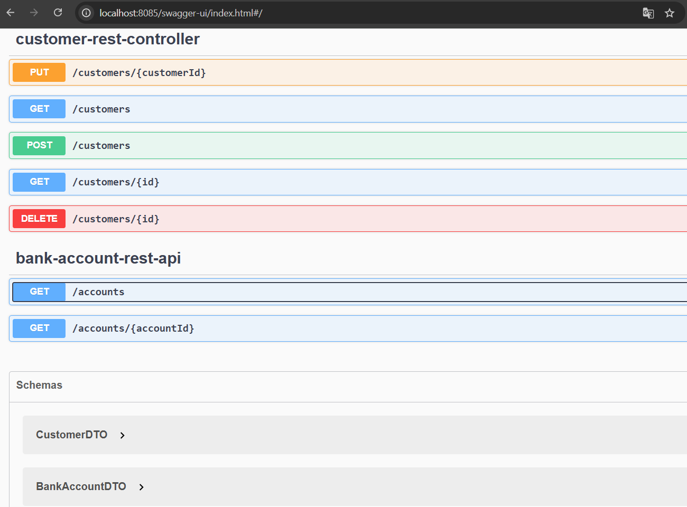
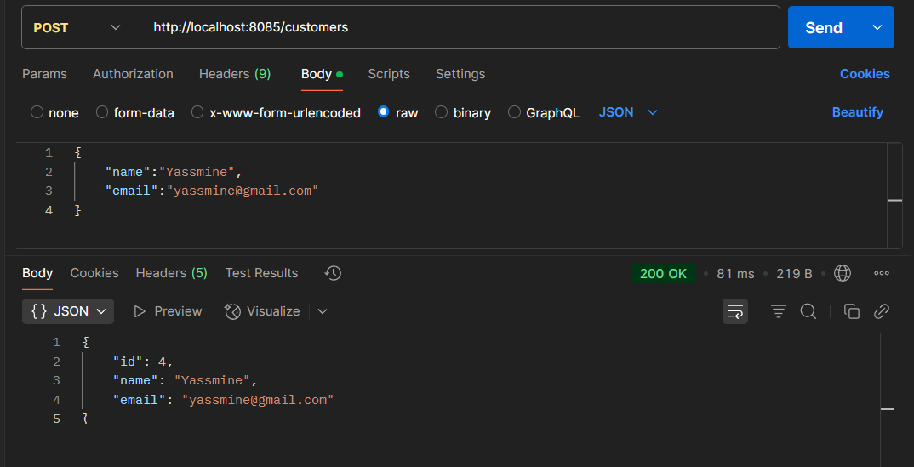
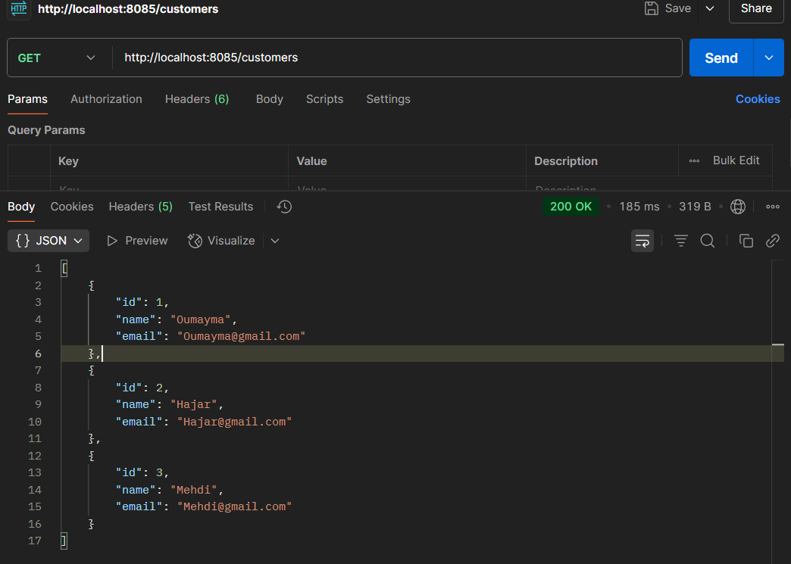
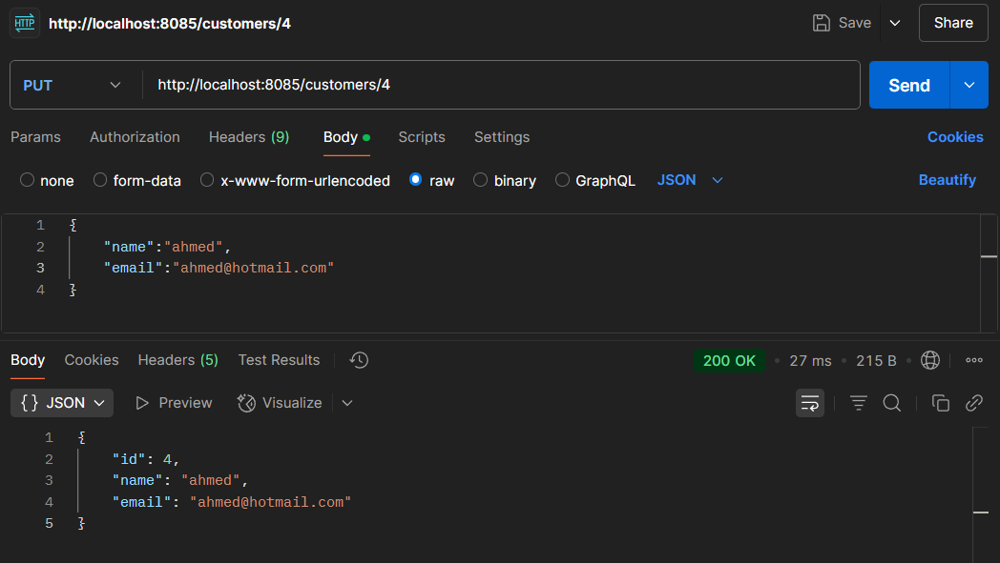
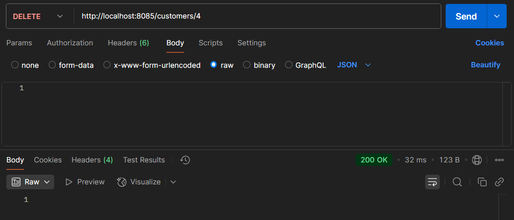
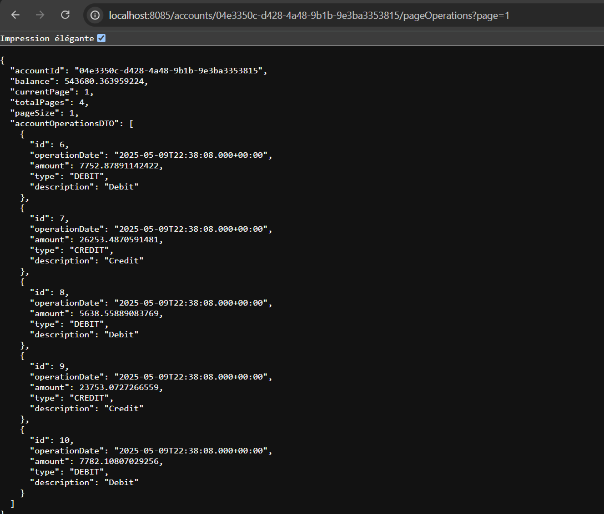
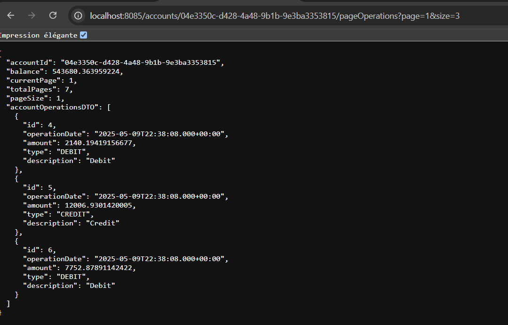

# Plateforme Bancaire Digitale

[](https://github.com/yourusername/digital-banking/actions)
[](LICENSE)
[](https://www.oracle.com/java/technologies/javase/jdk17-archive-downloads.html)
[](https://spring.io/projects/spring-boot)

## Résumé

Ce projet présente une implémentation complète d'une plateforme bancaire digitale utilisant les technologies Spring Boot et Java Enterprise Edition (JEE). La plateforme démontre des principes avancés d'ingénierie logicielle, des opérations bancaires sécurisées et une architecture évolutive. Elle sert d'implémentation pratique des systèmes bancaires modernes, intégrant des mesures de sécurité conformes aux standards de l'industrie et les meilleures pratiques de développement logiciel.

## Vue d'Ensemble du Système

La Plateforme Bancaire Digitale est une application de niveau entreprise robuste qui implémente les fonctionnalités bancaires essentielles à travers une architecture microservices. Le système est conçu pour fournir des services bancaires sécurisés, fiables et évolutifs tout en maintenant des standards élevés de performance et de sécurité.

## Fonctionnalités Principales

### Authentification et Sécurité
- Système d'authentification basé sur JWT
- Implémentation du contrôle d'accès basé sur les rôles
- Protocoles avancés de chiffrement et de sécurité des mots de passe
- Support de l'authentification multi-facteurs

### Système de Gestion des Utilisateurs
- Gestion complète de l'inscription et des profils utilisateurs
- Intégration de la conformité KYC (Know Your Customer)
- Gestion des rôles et permissions utilisateurs
- Système de vérification des comptes

### Traitement des Transactions
- Traitement des transactions en temps réel
- Gestion complète de l'historique des transactions
- Support multi-devises
- Validation et vérification des transactions

### Gestion des Comptes
- Support de plusieurs types de comptes (Courant, Épargne)
- Génération des relevés de compte
- Gestion des soldes
- Système de calcul des intérêts

## Architecture du Système

La plateforme implémente une architecture microservices avec les composants suivants :

```
┌─────────────────┐     ┌─────────────────┐     ┌─────────────────┐
│  Auth Service   │     │  User Service   │     │ Transaction     │
│  (JWT Auth)     │◄────┤  (User Mgmt)    │◄────┤ Service         │
└─────────────────┘     └─────────────────┘     └─────────────────┘
        ▲                       ▲                       ▲
        │                       │                       │
        ▼                       ▼                       ▼
┌─────────────────────────────────────────────────────────────┐
│                      API Gateway                            │
└─────────────────────────────────────────────────────────────┘
```

## Stack Technologique

### Technologies Backend
- Java 17
- Spring Boot 3.x
- Spring Security
- Spring Data JPA
- MySQL 8.0
- Maven

### Outils de Développement et Tests
- JUnit 5
- Mockito
- Swagger/OpenAPI
- Postman

## Prérequis Système

### Environnement de Développement
- Java Development Kit (JDK) 17 ou supérieur
- Maven 3.6 ou supérieur
- MySQL 8.0 ou supérieur
- Docker (optionnel)
- Système de contrôle de version Git

## Guide d'Implémentation

### Configuration du Dépôt
```bash
git clone https://github.com/yourusername/digital-banking.git
cd digital-banking
```

### Configuration de la Base de Données
```properties
# application.properties
spring.datasource.url=jdbc:mysql://localhost:3306/digital_banking
spring.datasource.username=your_username
spring.datasource.password=your_password
```

### Processus de Build
```bash
mvn clean install
```

## Instructions de Déploiement

### Déploiement Local
```bash
mvn spring-boot:run
```

### Déploiement Conteneurisé
```bash
# Construction de l'image Docker
docker build -t digital-banking .

# Déploiement du conteneur
docker run -p 8085:8080 digital-banking
```

## Documentation API

La documentation de l'API est accessible à :
```
http://localhost:8085/swagger-ui.html
```



### Points d'Entrée Principaux

#### Points d'Entrée d'Authentification
[Diagramme des Points d'Entrée d'Authentification]
- `POST /api/v1/auth/login` - Point d'entrée d'authentification
  - Corps de la requête : nom d'utilisateur, mot de passe
  - Réponse : token JWT, détails utilisateur
- `POST /api/v1/auth/refresh` - Point d'entrée de rafraîchissement du token
  - Corps de la requête : token de rafraîchissement
  - Réponse : nouveau token JWT

#### Points d'Entrée de Gestion des Utilisateurs
[Diagramme des Points d'Entrée de Gestion des Utilisateurs]
- `POST /api/v1/users/register` - Point d'entrée d'inscription
  - Corps de la requête : détails utilisateur, identifiants
  - Réponse : ID utilisateur, statut



- `GET /api/v1/users/profile` - Point d'entrée du profil utilisateur
  - Requête : token JWT
  - Réponse : données du profil utilisateur

- `GET /api/v1/users` - Point d'entrée pour lister les utilisateurs
  - Requête : (optionnel) paramètres de pagination/filtre
  - Réponse : liste des utilisateurs



- `PUT /api/v1/users/{userId}` - Point d'entrée pour mettre à jour un utilisateur
  - Corps de la requête : détails utilisateur mis à jour
  - Réponse : détails utilisateur mis à jour



- `DELETE /api/v1/users/{userId}` - Point d'entrée pour supprimer un utilisateur
  - Requête : (dans le chemin) ID utilisateur
  - Réponse : statut de la suppression



#### Points d'Entrée de Gestion des Comptes
[Diagramme des Points d'Entrée de Gestion des Comptes]
- `GET /api/v1/accounts` - Point d'entrée de gestion des comptes
  - Requête : token JWT
  - Réponse : liste des comptes utilisateur



- `POST /api/v1/accounts/create` - Point d'entrée de création de compte
  - Corps de la requête : type de compte, dépôt initial
  - Réponse : détails du compte

#### Points d'Entrée des Transactions
[Diagramme des Points d'Entrée des Transactions]
- `POST /api/v1/transactions/transfer` - Point d'entrée de traitement des transactions
  - Corps de la requête : compte source, compte destination, montant
  - Réponse : ID transaction, statut
- `GET /api/v1/transactions/history` - Point d'entrée de l'historique des transactions
  - Requête : ID compte, plage de dates
  - Réponse : liste des transactions



## Structure du Projet

Le projet suit un modèle d'architecture en couches avec une séparation claire des préoccupations. Voici une explication détaillée de chaque composant :

```
src/main/java/com/ebanking
├── config/         # Configuration système
├── dto/           # Objets de Transfert de Données
├── entities/      # Définitions des entités JPA
├── enums/         # Définitions des énumérations
├── exceptions/    # Gestion des exceptions
├── repositories/  # Couche d'accès aux données
├── services/      # Implémentation de la logique métier
└── web/          # Contrôleurs API REST
```

### Explication Détaillée des Composants

#### Couche de Configuration (`config/`)
- Contient toutes les classes de configuration système
- Configurations de sécurité (JWT, authentification)
- Configurations de base de données
- Propriétés de l'application
- Paramètres CORS (Cross-Origin Resource Sharing)
- Configuration de la documentation Swagger/OpenAPI

#### Objets de Transfert de Données (`dto/`)
- Définit les structures de données pour les requêtes et réponses API
- Sépare les modèles de données internes des représentations externes
- Inclut les annotations de validation
- Gère la transformation des données entre les couches
- Exemple : UserDTO, TransactionDTO, AccountDTO

#### Couche Entités (`entities/`)
- Définitions des entités JPA pour le mapping base de données
- Définit les relations entre les entités
- Contient les modèles d'objets métier
- Implémente les annotations JPA pour l'ORM
- Exemple : entités User, Account, Transaction

#### Couche Énumérations (`enums/`)
- Définit les valeurs et types constants
- Types de comptes (ÉPARGNE, COURANT)
- Types de transactions (DÉPÔT, RETRAIT, TRANSFERT)
- Rôles utilisateurs (ADMIN, UTILISATEUR)
- Énumérations de statut (ACTIF, INACTIF, EN_ATTENTE)

#### Gestion des Exceptions (`exceptions/`)
- Classes d'exceptions personnalisées
- Gestionnaire d'exceptions global
- Exceptions de logique métier
- Exceptions de validation
- Exceptions liées à la sécurité

#### Couche Repository (`repositories/`)
- Implémentation de la couche d'accès aux données
- Étend les repositories JPA
- Méthodes de requête personnalisées
- Opérations de base de données
- Gestion des transactions

#### Couche Service (`services/`)
- Implémentation de la logique métier
- Gestion des transactions
- Validation des données
- Application des règles métier
- Intégration avec les services externes

#### Couche Web (`web/`)
- Contrôleurs API REST
- Mapping des requêtes
- Gestion des réponses
- Validation des entrées
- Annotations de sécurité

## Guide de Développement

### Processus de Contribution
1. Fork du dépôt
2. Création d'une branche fonctionnalité (`git checkout -b feature/NomFonctionnalite`)
3. Implémentation des modifications
4. Commit des modifications (`git commit -m 'Implémentation NomFonctionnalite'`)
5. Push sur la branche (`git push origin feature/NomFonctionnalite`)
6. Soumission d'une pull request

## Annotations Spring Framework

Le projet utilise un ensemble d'annotations Spring Framework pour la configuration et le développement. Voici une description détaillée des annotations principales utilisées :

### Annotations de Configuration
| Annotation | Description | Exemple d'Utilisation |
|------------|-------------|----------------------|
| `@SpringBootApplication` | Point d'entrée principal de l'application Spring Boot | `@SpringBootApplication public class EbankingApplication` |
| `@Configuration` | Indique que la classe contient des configurations Spring | `@Configuration public class SecurityConfig` |
| `@EnableWebSecurity` | Active la sécurité web de Spring | `@EnableWebSecurity public class WebSecurityConfig` |

### Annotations de Couche
| Annotation | Description | Exemple d'Utilisation |
|------------|-------------|----------------------|
| `@RestController` | Définit un contrôleur REST avec réponse JSON | `@RestController @RequestMapping("/api/v1")` |
| `@Service` | Marque une classe comme service métier | `@Service public class UserServiceImpl` |
| `@Repository` | Indique une couche d'accès aux données | `@Repository public interface UserRepository` |

### Annotations de Persistance
| Annotation | Description | Exemple d'Utilisation |
|------------|-------------|----------------------|
| `@Entity` | Définit une classe comme entité JPA | `@Entity @Table(name = "users")` |
| `@Id` | Définit la clé primaire | `@Id private Long id` |
| `@GeneratedValue` | Configure la génération automatique des valeurs | `@GeneratedValue(strategy = GenerationType.IDENTITY)` |
| `@Column` | Configure les propriétés d'une colonne | `@Column(nullable = false, unique = true)` |

### Annotations de Relations
| Annotation | Description | Exemple d'Utilisation |
|------------|-------------|----------------------|
| `@OneToMany` | Relation un-à-plusieurs | `@OneToMany(mappedBy = "user")` |
| `@ManyToOne` | Relation plusieurs-à-un | `@ManyToOne @JoinColumn(name = "user_id")` |
| `@OneToOne` | Relation un-à-un | `@OneToOne(cascade = CascadeType.ALL)` |
| `@ManyToMany` | Relation plusieurs-à-plusieurs | `@ManyToMany @JoinTable(name = "user_roles")` |

### Annotations de Sécurité
| Annotation | Description | Exemple d'Utilisation |
|------------|-------------|----------------------|
| `@PreAuthorize` | Sécurisation au niveau méthode | `@PreAuthorize("hasRole('ADMIN')")` |
| `@Secured` | Sécurisation basée sur les rôles | `@Secured("ROLE_USER")` |
| `@EnableGlobalMethodSecurity` | Active la sécurité au niveau méthode | `@EnableGlobalMethodSecurity(prePostEnabled = true)` |

### Annotations d'Injection
| Annotation | Description | Exemple d'Utilisation |
|------------|-------------|----------------------|
| `@Autowired` | Injection de dépendance automatique | `@Autowired private UserService userService` |
| `@Qualifier` | Spécifie le bean à injecter | `@Qualifier("userServiceImpl")` |
| `@Value` | Injection de valeurs de propriétés | `@Value("${jwt.secret}")` |

### Annotations de Validation
| Annotation | Description | Exemple d'Utilisation |
|------------|-------------|----------------------|
| `@Valid` | Active la validation des objets | `@Valid @RequestBody UserDTO userDTO` |
| `@NotNull` | Vérifie qu'une valeur n'est pas nulle | `@NotNull private String username` |
| `@Size` | Vérifie la taille d'une collection | `@Size(min = 6, max = 20)` |

### Annotations de Documentation
| Annotation | Description | Exemple d'Utilisation |
|------------|-------------|----------------------|
| `@ApiOperation` | Documente une opération API | `@ApiOperation("Créer un nouvel utilisateur")` |
| `@ApiResponse` | Documente une réponse API | `@ApiResponse(code = 201, message = "Utilisateur créé")` |
| `@ApiModel` | Documente un modèle | `@ApiModel(description = "Modèle d'utilisateur")` |

Ces annotations sont utilisées de manière cohérente à travers le projet pour assurer :
- Une architecture propre et maintenable
- Une séparation claire des responsabilités
- Une sécurité robuste
- Une documentation API complète
- Une gestion efficace des données

## 👨‍💻 Auteur

**Nom**: DAOUDI Oumayma 

**Établissement**: ENSET Mohammedia  

**Filière**: GLSID 2 

**Encadrant**: Professeur Mohamed YOUSSFI

*Ce projet a été développé dans le cadre d'un projet académique.*


